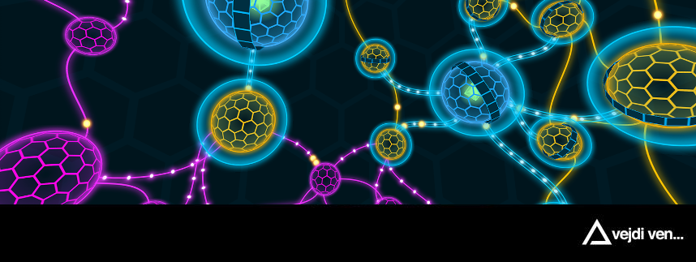
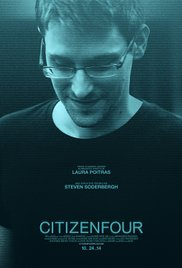
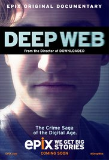

# Tor Meetup

Po vzoru populárních Bitcoin meetupů startujeme v [Paralelní Polis](https://www.paralelnipolis.cz/kontakt/) nový cyklus pravidelných setkání. Věnovat se v nich budeme anonymizačním technologiím typu Tor a dalším navazujících tématům. Tor meetup je určen pro všechny příznivce šifrování, anonymity, kyberaktivismu, pro ty, kdo chtějí aktivně porozumět ochraně svého soukromí a bezpečnosti na Internetu.

Tato témata byla v minulosti spíše výsadou hackerů a počítačového undergroundu. Dnes se ovšem díky rostoucím zásahům států a korporací do našich životů stávají aktuálními pro širší publikum.

Motivací cyklu Tor meetupů je přiblížit návštěvníkům srozumitelnou formou jednotlivé anonymizační technologie a zdůraznit jejich důležitost v teoretické i praktické rovině.

Zajímavé odkazy, pojmy, motivační filmy a události najdete na https://github.com/ParalelniPolis/tor-meetup

**Setkání se budou odehrávat jednou za 14 nebo 28 dní ve středu ve 20h v Institutu Kryptoanarchie Paralelní Polis.**

**Vstupné je dobrovolné, bez registrace.**

Když chcete podpořit tento meetup, jeho [aktivity](#aktivity) a další rozvoj, můžete tak učinit na bitcoinové adrese:

[1N3Mafk6nTxds5wnKUkQV7iHnsUjSN9UXz](https://blockchain.info/address/1N3Mafk6nTxds5wnKUkQV7iHnsUjSN9UXz).

## Události

| datum | # | řečník | název | odkazy | materiály |
|-------|---|--------|-------|--------|-----------|
| 09.03.2016 | 001 | Pavol Rusnák | Úvod | [fb](https://www.facebook.com/events/1593754657613557/) | [slajdy](https://github.com/ParalelniPolis/tor-meetup/raw/gh-pages/slides/001.pdf) |
| 06.04.2016 | 002 | Jan Švec, Jan Pochyla, Pavol Rusnák | Šifrovaná komunikace | [fb](https://www.facebook.com/events/1696169690668939/) | [slajdy](https://github.com/ParalelniPolis/tor-meetup/raw/gh-pages/slides/002.pdf) |
| 18.05.2016 | 003 | a) Pavol Rusnák b) AnonQchan | a) Bezpečné distribuce b) Dokonalá anonymita | [fb](https://www.facebook.com/events/1601385133510140/) | a) [slajdy](https://github.com/ParalelniPolis/tor-meetup/raw/gh-pages/slides/003.pdf) b) [video](https://github.com/ParalelniPolis/tor-meetup/raw/gh-pages/slides/003.mp4) |
| 01.06.2016 | 004 | hiviah | Útoky na Tor - především ty praktické | [fb](https://www.facebook.com/events/279605345710179/) | - |

## Aktivity

* organizování meetupů
* + zajišťování zajímavých hostů ze zahraničí
* "cenzurující" VPN, která umožní jednoduše se podívat, jak vidí Internet lidé v Číne, Rusku a jiných státech, které ho cenzurují
* různé workshopy (např. instalace Tor na Raspberry Pi)
* provoz Tor relay a/nebo Tor exit nodů:

| jméno | typ   | odkazy |
|-------|-------|--------|
| sway  | relay | [atlas](https://atlas.torproject.org/#details/77204802405A7DF1E7BD3BC579F8D1D7FB81DFD4) [globe](https://globe.torproject.org/#/relay/77204802405A7DF1E7BD3BC579F8D1D7FB81DFD4) |
| enyo  | relay | [atlas](https://atlas.torproject.org/#details/E093E884517F5E91166EE8790241A3A7008FF303) [globe](https://globe.torproject.org/#/relay/E093E884517F5E91166EE8790241A3A7008FF303) |

## Základní pojmy

* Anonymita
  * utajení totožnosti osoby, případně instituce, z důvodu zachování soukromí či vyhnutí se důsledkům svého jednání
* Šifrování
  * proces, kterým se nezabezpečená elektronická data převádí za pomoci kryptografie na data šifrovaná, čitelná pouze pro majitele dešifrovacího klíče; slouží k ochraně dat proti nežádoucímu zjištění cizí osobou a uplatňuje se při ukládání dat i při jejich přenosu včetně telekomunikace
* Bezpečnost
  * soubor opatření, jež mají za cíl znemožnit, nebo maximálně znesnadnit útočníkovi získání soukromých či neveřejných dat, nebo zabránit pokusu převzetí vlády nad počítačem, případně vyřaděním počítače nebo celé sítě z činnosti
* Kyberaktivismus
  * využívání internetových prostředků a anonymity či pseudonymity internetu k politickému a dalšímu aktivismu, agitaci, organizaci a vytváření hnutí
* Whistleblowing
  * fenomén, kdy zaměstnanci státní správy nebo velkých firem upozorní na trestné nebo podezřelé jednání, o kterém se dozvěděli jen díky svému postavení a interním informacím
* Darknet (někdy také Deep web)
  * skrytá vrstva klasického internetu, operující na principu anonymního připojení skrze šifrované decentralizované sítě

## Motivační filmy

   

## Kontakt

Pořadatelem meetupů je Pavol Rusnák: [email](mailto:stick@gk2.sk?subject=Tor%20Meetup), [PGP klíč](https://pgp.mit.edu/pks/lookup?op=get&search=0x91F3B339B9A02A3D)

V případě, že chcete vystoupit s vlastním tématem, neváhejte se ozvat. Děkuji!

## Zajímavé odkazy

* https://www.torproject.org/

* https://torflow.uncharted.software/
* https://atlas.torproject.org/
* https://globe.torproject.org/
* https://torstatus.blutmagie.de/
* https://metrics.torproject.org/

* https://tails.boum.org/
* https://subgraph.com/sgos/

* https://ricochet.im/

* https://wikileaks.org/
* https://securedrop.org/
* https://ahmia.fi/
